

  <picture>
    <source media="(prefers-color-scheme: dark)" srcset="assets/logoRasterizado.png">
    
  </picture>

  Una <em>galería web moderna</em> con funcionalidad <em>AJAX</em> en tiempo real, diseñada para mostrar hasta 50 imágenes por álbum. Con un diseño adaptable, ofreciendo un modo oscuro para una experiencia visual cómoda en cualquier entorno. Teniendo capacidad para 2 tipos de Usuario: Administrador y Usuario. Cambiando la vista y funcionalidades en base del usuario elegido.

  
  &nbsp;
  
  &nbsp;

## Vista de la Galería

 <b>Apartado de Imágenes Sueltas</b> 

  <picture>
    <source media="(prefers-color-scheme: dark)" srcset="assets/GaleriaPreview.png">
    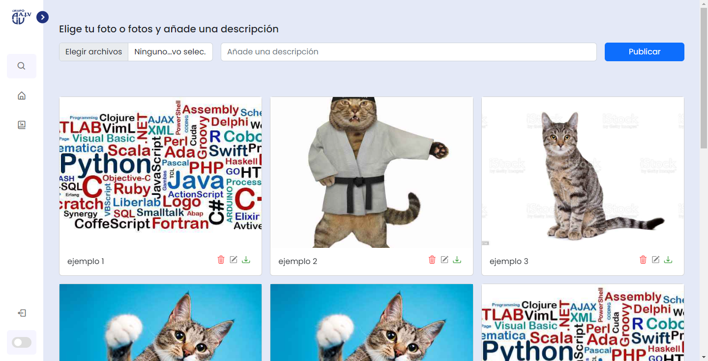
  </picture>

 <b>Apartado de Albumes</b> 

  <picture>
    <source media="(prefers-color-scheme: dark)" srcset="assets/GaleriaAlbumesPreview.png">
    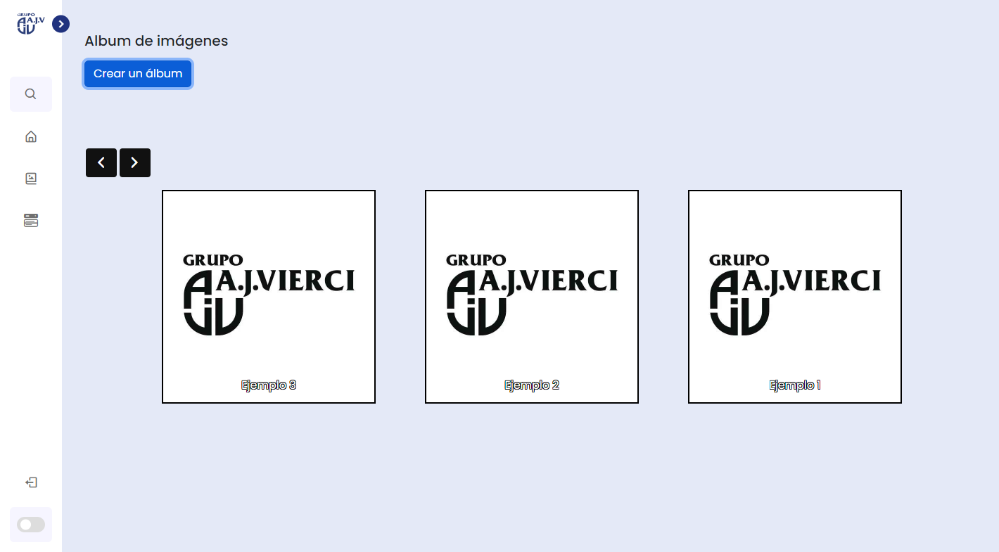
  </picture>

## Funciones de la Galería
- Diseño Responsive y Adaptable
- Modo Oscuro
- Paginación en base a las imágenes cargadas
- Apartado de Login y Logout
- Barra de Navegación expandible
- Descarga de varias imágenes en grupo en formato zip
- Edición de las descripciones de las imágenes
- Eliminación de las imágenes en grupo
- Búsqueda de imágenes teniendo en cuenta la descripción
## Funciones exclusivas de los álbumes
- Zoom en fotos
- Rotar imágenes
- Escalado automático teniendo en cuenta la resolución de la pantalla
- Botón para poner la imágen en pantalla completa
- Botón para hacer auto-play de todas las imágenes en el álbum
> Todo esto gracias a la librería <a href="https://github.com/nanostudio-org/nanogallery2">NanoGallery2</a>.

## Guía de Usuario
### Pasos para cargar una imágen
1. Damos click al botón azul con el ícono de una imágen.
2. Seleccionamos la/las imágenes a subir (el límite en imágenes sueltas es de 5 imágenes).
3. Agregamos una descripción breve de la imágen a subir.
4. Damos click al botón azul con el ícono de una flecha hacia arriba.
> Aquí un gif indicando el paso a paso 😺👇

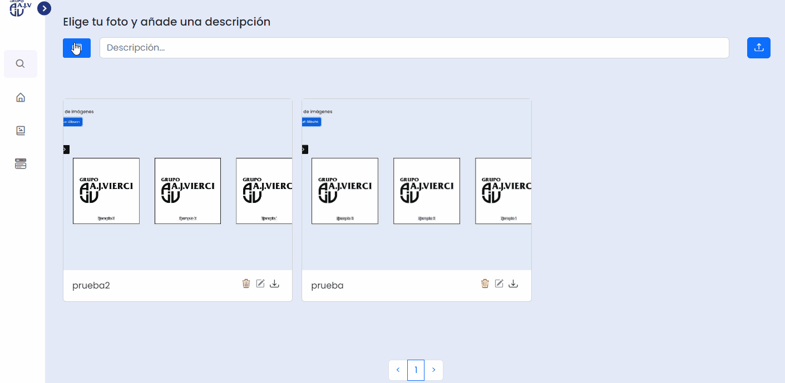</img>

### Pasos para borrar una imágen/album
1. Buscamos el ícono del basurero rojo en la derecha de la imágen (En el caso de los álbumes, arriba en la izquierda al pasar el ratón sobre la imágen).
2. Le damos click al ícono y nos saldrá un panel en donde nos pregunta si eliminar la imágen o no.
3. Le damos click en Aceptar en el caso de querer borrar una imágen.
4. Le damos click en Cancelar en caso de que fue un miss-click y no ocurrirá nada.
>Aquí un gif indicando el paso a paso 🐱👇

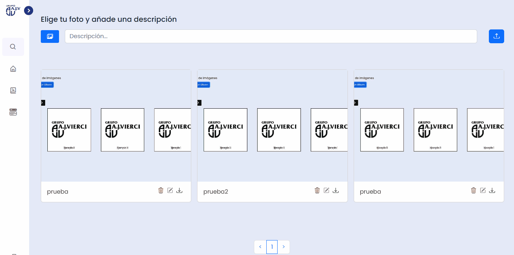</img>

### Pasos para editar la descripción de la imágen/álbum
1. Buscamos el ícono del lapiz en la derecha de la imágen (En el caso de los álbumes, arriba en la izquierda al pasar el ratón sobre la imágen).
2. Le damos click al ícono y se desplegará una caja en donde podremos cambiar la descripción.
3. Para guardar la descripción editada, le damos click al botón "Guardar". Si nos equivocamos y no queremos guardar, al botón "Cancelar".
4. Habremos cambiado la descripción.
>Aquí un gif indicando el paso a paso 😼👇

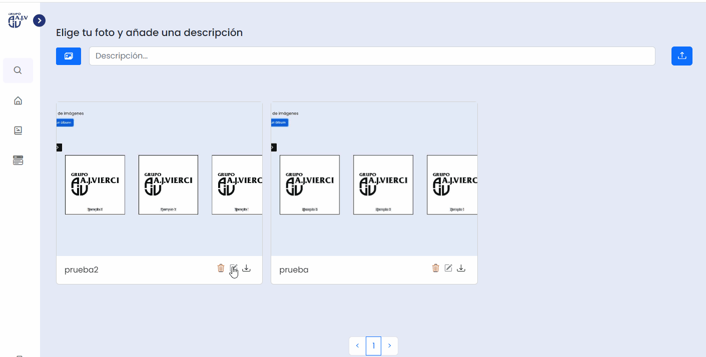</img>

### Pasos para descargar la/las imágen/es.
1. Buscamos el ícono de descarga en la derecha de la imágen (En el caso de los álbumes, arriba en la izquierda al pasar el ratón sobre la imágen).
2. Le damos click al ícono y comenzará a descargar como archivo Zip en nuestro navegador
3. Habremos descargado el álbum o imágen.
>Aquí un gif indicando el paso a paso 😼👇

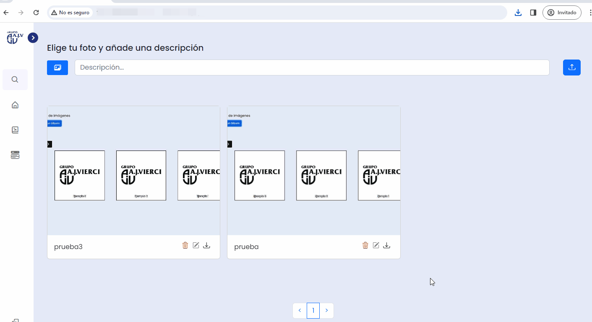</img>

### Pasos para buscar una imágen
1. Le damos click al ícono de la lupa en la barra de navegación.
2. Se desplegará la barra de navegación dando a lugar un espacio donde escribir la descripción a consultar.
3. Una vez ingresada la descripción de la foto a buscar, le damos a "Enter" en el teclado.
4. Nos mostrará la búsqueda en la galería.
> [!TIP]
> Para salir del modo búsqueda podemos darle al ícono de Inicio que está debajo del ícono de Búsqueda.

>Aquí un gif indicando el paso a paso 🐱⬇️

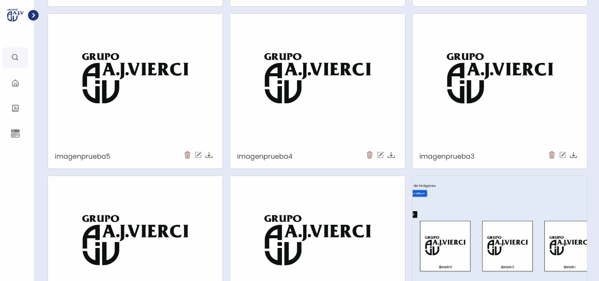</img>

### Modo Oscuro
1. Para activar el modo oscuro de la galería, le tenemos que dar al switch que se encuentra abajo mismo de la barra de navegación.
> [!TIP]
> Para intercambiar entre ambos modos se puede dar click de nuevo al botón.

>Aquí un gif indicando el paso a paso 🐱🌃🌇

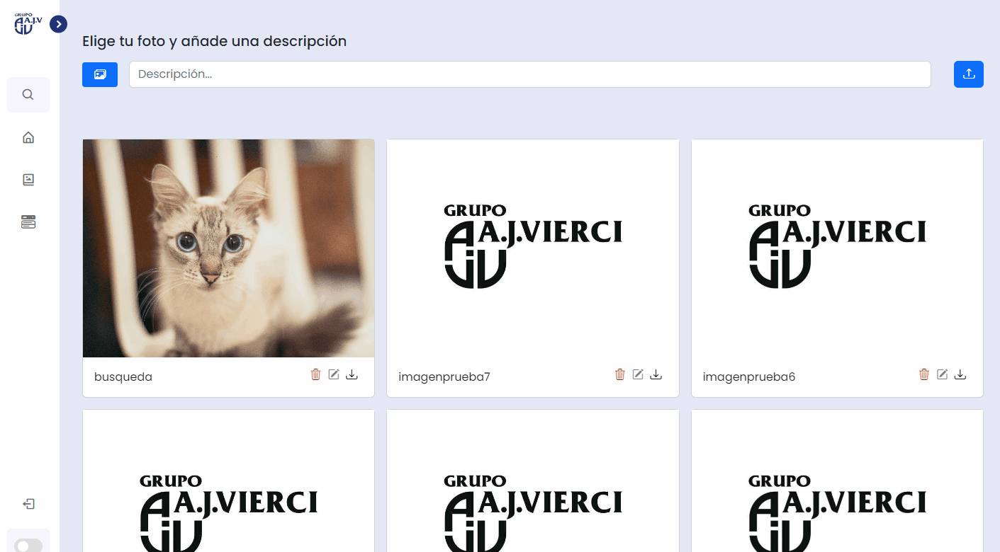</img>

## Menú de Usuarios
> [!IMPORTANT]
> Estas funciones solamente están disponibles para los administradores.
### Añadir nuevo usuario
1. Desplegamos la barra de navegación
2. Buscamos la sección de Menú y le damos click.
3. Nos abrirá el panel.
4. Buscamos el botón que dice "Añadir Nuevo Usuario" y le damos click.
5. Rellenamos a gusto y le damos click en "Añadir".
6. Un usuario nuevo será añadido.

>Aquí un gif indicando el paso a paso 🤓

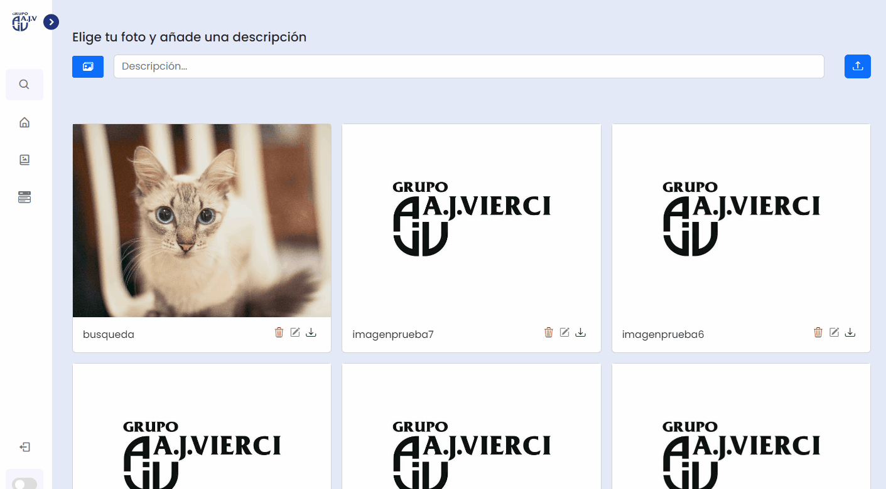</img>
### Eliminar un usuario
1. Buscamos el ícono de basurero rojo en la parte derecha, debajo del texto "Acciones".
2. Le damos click y nos saldrá una ventana preguntando si queremos o no eliminar el usuario.
3. Le damos en "Aceptar".
4. Borraremos un usuario.

>Aquí un gif indicando el paso a paso 😄

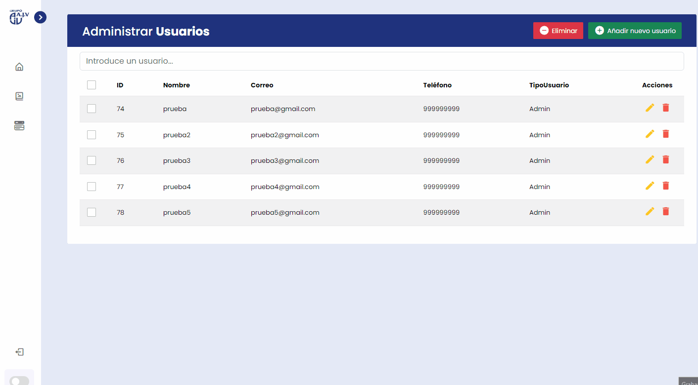</img>

> [!TIP]
> También podemos eliminar varios usuarios haciendo lo siguiente:

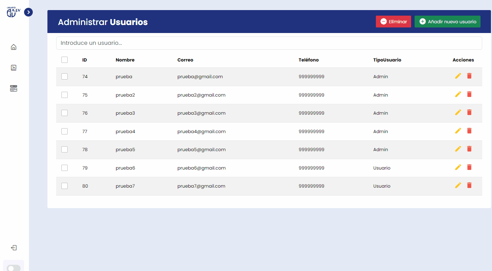</img>

### Editar Usuario
1. Buscamos el ícono del lápiz amarillo en la parte derecha, debajo del texto "Acciones".
2. Le damos click y nos saldrá una ventana para rellenar de nuevo los datos del usuario.
3. Cambiamos los datos a necesidad.
4. Editaremos los datos del usuario.

>Aquí un gif indicando el paso a paso 😄

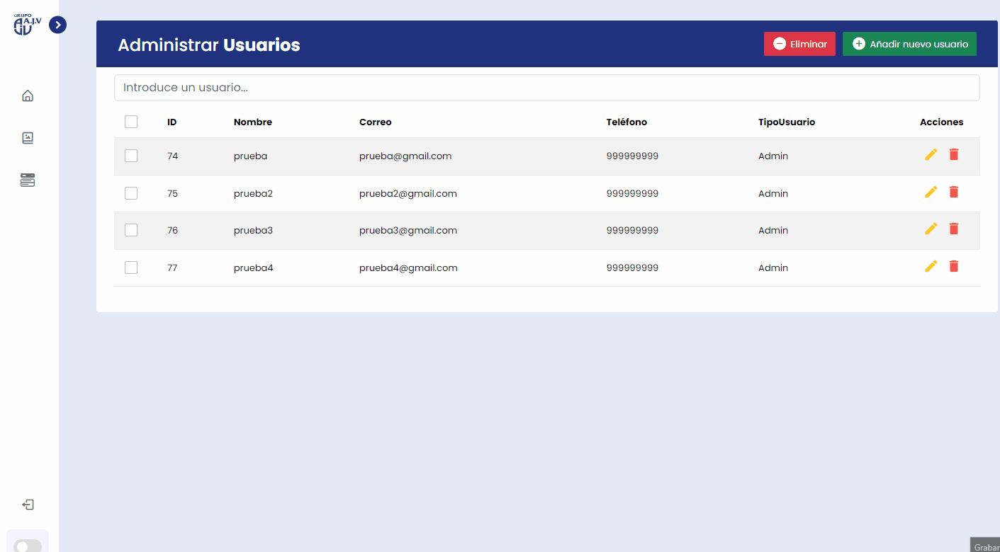</img>

### Buscar Usuario
1. Ingresamos cualquier dato del usuario que queremos consultar en la barra que dice Introduce un usuario.
2. Al ingresar los datos buscará de forma instantánea en toda la tabla.
3. Buscamos un usuario a gusto.

>Aquí un gif indicando el paso a paso 🧐

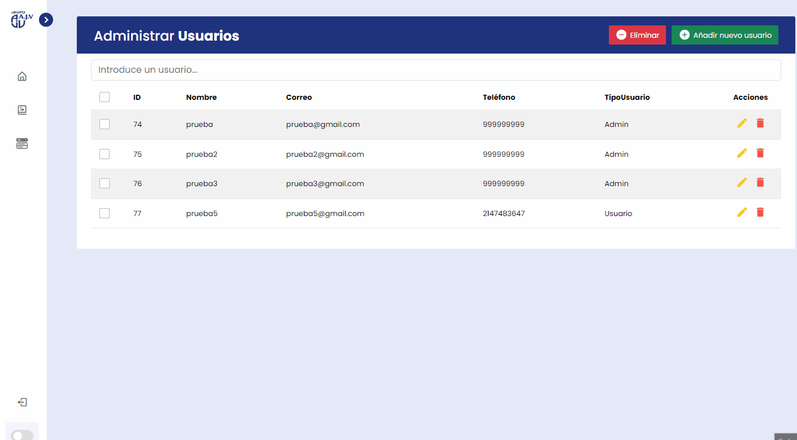</img>

## Tecnologías Utilizadas
- <a href="https://releases.jquery.com/">Jquery 3.7.1 </a>
- <a href="https://www.php.net/downloads">PHP 8</a>
- <a href="https://github.com/nanostudio-org/nanogallery2">NanoGallery2</a>
- <a href="https://github.com/han109k/light-switch-bootstrap">Light Switch Bootstrap</a>
- <a href="https://fonts.google.com/">Google Fonts</a>
- <a href="https://getbootstrap.com/">Bootstrap 5.3.3</a> y <a href="https://icons.getbootstrap.com/">Bootstrap Icons 1.11.0</a>
- <a href="https://boxicons.com/">Boxicons 2.1.4</a>
- <a href="https://fontawesome.com/download">Font Awesome 6.5.2</a>
- <a href="https://stuk.github.io/jszip/">JSZip 3.10.1</a>
- <a href="https://www.mysql.com/">MySQL</a>

## Contribuidores del proyecto
- [José Ramírez](https://github.com/kuuukooo)
- [Lucas Noguera](https://github.com/LucasGabrielNogueraGozlez)
- [Danny Ayala](https://github.com/DannyAyalaM) **- Eternas Gracias a Danny por toda la ayuda durante el proyecto. :+1:**
